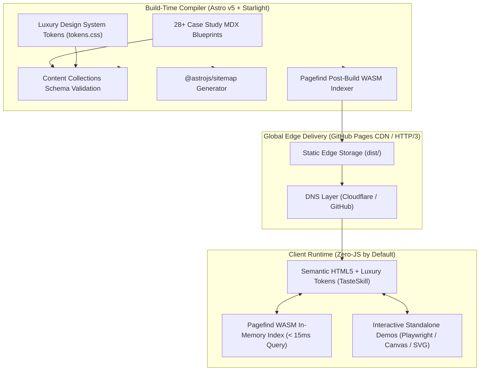

<a id="readme-top"></a>

<!-- HERO / HEADER SECTION -->
<div align="center">
  <a href="https://zadevpenseo.github.io">
    
  </a>

  <br /><br />

  <h1>Zadit // Systems Architecture & Blueprints Vault</h1>

  <p align="center">
    <strong>Deterministic High-Level System Design (HLD), Applied Mathematical Modeling, and Production Case Studies</strong>
    <br />
    <em>Published under the legal entity <strong>PT PRISMA DIGITAL KREATIF</strong> (NIB: 1801250039976 · TDPSE Kominfo: 017014.01/DJAI.PSE/01/2025)</em>
  </p>

  <p align="center">
    <a href="https://zadevpenseo.github.io"><strong>⚡ Explore Live Vault</strong></a> •
    <a href="https://zadevpenseo.github.io/case-studies/">📚 <strong>Master Case Studies</strong></a> •
    <a href="https://zadevpenseo.github.io/demos/jira-weekly-report/">🎮 <strong>Live Demos</strong></a> •
    <a href="#-academic--industry-citation">🎓 <strong>Cite Vault</strong></a> •
    <a href="mailto:devapenseo@gmail.com">💼 <strong>Direct Inquiries</strong></a>
  </p>

  <!-- SHIELDS.IO BADGES -->
  <p align="center">
    <a href="https://github.com/zadevpenseo/zadevpenseo.github.io/actions/workflows/deploy.yml"></a>
    <a href="https://starlight.astro.build"></a>
    <a href="https://www.tasteskill.dev"></a>
    <a href="https://pagefind.app"></a>
    <a href="LICENSE"></a>
  </p>

  <!-- ACADEMIC & ENTITY BADGES -->
  <p align="center">
    <a href="https://orcid.org/0000-0002-1594-9548"></a>
    <a href="https://scholar.google.com/citations?user=CbR250MAAAAJ"></a>
    <a href="https://www.wikidata.org/wiki/Q141474900"></a>
    <a href="https://www.wikidata.org/wiki/Q141474927"></a>
  </p>
</div>

---

<!-- TABLE OF CONTENTS -->
<details open>
  <summary>📌 <strong>Table of Contents</strong></summary>
  <ol>
    <li><a href="#-about-the-systems-vault">About the Systems Vault</a></li>
    <li><a href="#-systems-architecture-topology">Systems Architecture Topology</a></li>
    <li><a href="#-the-four-canonical-architectural-pillars">The Four Canonical Architectural Pillars</a></li>
    <li><a href="#-interactive-demos--artifact-vault">Interactive Demos & Artifact Vault</a></li>
    <li><a href="#-the-3-tier-adaptive-proof-paradigm">The 3-Tier Adaptive Proof Paradigm</a></li>
    <li><a href="#-web-performance--core-web-vitals">Web Performance & Core Web Vitals</a></li>
    <li><a href="#-local-development--build-pipeline">Local Development & Build Pipeline</a></li>
    <li><a href="#-academic--industry-citation">Academic & Industry Citation</a></li>
    <li><a href="#-community-security--contributing">Community, Security & Contributing</a></li>
    <li><a href="#-principal-systems-architect">Principal Systems Architect</a></li>
  </ol>
</details>

---

## 📖 About the Systems Vault

**`zadevpenseo.github.io`** is the open-access engineering portfolio, technical case study hub, and high-level architecture repository created by **Muhammad Khoiruzzadittaqwa (Zadit)**. 

Unlike traditional static portfolios that showcase speculative mockups, this repository serves as a **deterministic technical proof engine**. Every case study contains:
- Complete **10-Step High-Level System Designs (HLD)** breaking down business requirements, components, API contracts, scalability, observability, and trade-offs.
- **Deployable Interactive Prototypes** embedded directly with full-screen, expandable viewers and downloadable production source files.
- Rigorous mathematical and empirical grounding rooted in formal Mathematics Education (140 SKS, GPA 3.71, Advanced Statistics 89.8 / A-).
- Zero "AI Slop" or generic marketing fluff: strict adherence to William Strunk Jr. clarity guidelines, active voice, and verifiable technical metrics.

<p align="right">(<a href="#readme-top">back to top</a>)</p>

---

## 🏛️ Systems Architecture Topology

The vault is built on **Astro v5**, **@astrojs/starlight**, and **Pagefind WASM**, compiled into pure static edge artifacts delivered globally via the GitHub Pages CDN:



<p align="right">(<a href="#readme-top">back to top</a>)</p>

---

## 🧩 The Four Canonical Architectural Pillars

Our engineering case studies are organized across four specialized disciplines:

| Pillar | Engineering Scope | Key Production Blueprints |
| :--- | :--- | :--- |
| **1. Web Dev Design** | High-performance edge serverless, responsive luxury UI/UX, database rescues, and zero-dependency deliverables. | • [Gworky Edge Next.js Flagship](https://zadevpenseo.github.io/case-studies/web-dev-design/gworky-edge-web-app/)<br />• [WooCommerce Platform Optimization](https://zadevpenseo.github.io/case-studies/web-dev-design/woocommerce-enhancement-659829/)<br />• [DevPDF.in Engine & Conversion Architecture](https://zadevpenseo.github.io/case-studies/web-dev-design/pdf-tools-devpdf-repair-658700/)<br />• [Interactive Web Audio & Canvas Engine](https://zadevpenseo.github.io/case-studies/web-dev-design/interactive-birthday-card-web-656043/)<br />• [High-Performance Animated Landing Engine](https://zadevpenseo.github.io/case-studies/web-dev-design/animated-landing-page-659928/)<br />• [Modular Fullstack Web Architecture](https://zadevpenseo.github.io/case-studies/web-dev-design/fullstack-custom-web-apps-659861/) |
| **2. SEO** | Programmatic search at scale, Schema.org entity knowledge graphs, technical audits, and Generative Engine Optimization (GEO). | • [Programmatic SEO Edge Scale Engine](https://zadevpenseo.github.io/case-studies/seo/programmatic-seo-scale-engine/)<br />• [Technical SEO & GA4/GSC Audit (Vidio/Tirto)](https://zadevpenseo.github.io/case-studies/seo/technical-seo-vidio-tirto-audit/)<br />• [National SEO Competition Award (WOM Finance)](https://zadevpenseo.github.io/case-studies/seo/national-seo-competition-wom-finance/)<br />• [Entity Knowledge Graph Architecture](https://zadevpenseo.github.io/case-studies/seo/knowledge-graph-entity-architecture/) |
| **3. Writer** | Executive boardroom flywheels, 5-year bankable financial feasibility models, and peer-reviewed scientific publications. | • [Executive Pitch Decks (JCG Partnership)](https://zadevpenseo.github.io/case-studies/writer/executive-pitch-decks-jcg-partnership/)<br />• [Business Feasibility & Financial Models](https://zadevpenseo.github.io/case-studies/writer/business-feasibility-financial-models/)<br />• [Peer-Reviewed Empirical Research (APA 7th)](https://zadevpenseo.github.io/case-studies/writer/peer-reviewed-empirical-publishing/)<br />• [Cinematic 3D Direction & Narrative Architecture](https://zadevpenseo.github.io/case-studies/writer/cinematic-3d-birthday-video-659866/) |
| **4. Data Analysis** | Applied mathematics, Rasch Rating Scale psychometrics, stealth Chrome DevTools Protocol scraping, and deterministic reporting pipelines. | • [Automated Jira Weekly Performance Pipeline](https://zadevpenseo.github.io/case-studies/data-analysis/jira-weekly-report-automation-40725359/)<br />• [Enterprise Power BI & Power Query ETL](https://zadevpenseo.github.io/case-studies/data-analysis/power-bi-power-query-etl-650821/)<br />• [Mathematical Modeling & Statistics (140 SKS)](https://zadevpenseo.github.io/case-studies/data-analysis/mathematical-modeling-and-statistics/)<br />• [Psychometric Survey Validation (Rasch & Aiken)](https://zadevpenseo.github.io/case-studies/data-analysis/psychometric-survey-validation-rasch/)<br />• [Resilient CDP WebSocket Scraping Engine](https://zadevpenseo.github.io/case-studies/data-analysis/resilient-cdp-websocket-scraping/)<br />• [Morpheus V2 Financial Simulation Model](https://zadevpenseo.github.io/case-studies/data-analysis/morpheus-v2-tax-simulation-659758/)<br />• [DocuMorph PDF Table Extraction](https://zadevpenseo.github.io/case-studies/data-analysis/documorph-pdf-table-extraction/) |

<p align="right">(<a href="#readme-top">back to top</a>)</p>

---

## 🎮 Interactive Demos & Artifact Vault

All interactive prototypes are deployed as standalone, zero-dependency artifacts accompanied by open-source inspection packages:

<table width="100%">
  <tr>
    <td width="33%" valign="top">
      <h3>📊 Jira Weekly Executive Report</h3>
      <p>Serverless data engineering pipeline aggregating Jira Cloud velocity and dev workload into an executive A4 PDF.</p>
      <ul>
        <li><a href="https://zadevpenseo.github.io/demos/jira-weekly-report/"><strong>🌐 Open Standalone Demo</strong></a></li>
        <li><a href="https://zadevpenseo.github.io/demos/jira-weekly-report/jira_weekly_executive_report.pdf">📥 Download Master PDF (299 KB)</a></li>
        <li><a href="https://zadevpenseo.github.io/case-studies/data-analysis/jira-weekly-report-automation-40725359/">📖 Read 10-Step HLD</a></li>
      </ul>
    </td>
    <td width="33%" valign="top">
      <h3>✨ Aura Studio Animated Landing</h3>
      <p>Sub-25KB turnkey creative agency showcase featuring 60 FPS GPU-accelerated micro-interactions and zero CDN bloat.</p>
      <ul>
        <li><a href="https://zadevpenseo.github.io/demos/animated-landing/"><strong>🌐 Open Standalone Demo</strong></a></li>
        <li><a href="https://zadevpenseo.github.io/case-studies/web-dev-design/animated-landing-page-659928/">📖 Read 10-Step HLD</a></li>
      </ul>
    </td>
    <td width="33%" valign="top">
      <h3>🎂 HeartCraft Sensory Engine</h3>
      <p>8-beat sensory web greeting featuring Web Audio synthesizer, canvas particle physics, and dual-device WebRTC remote wand.</p>
      <ul>
        <li><a href="https://zadevpenseo.github.io/demos/birthday-card/?to=Sakshi"><strong>🌐 Open Standalone Demo</strong></a></li>
        <li><a href="https://zadevpenseo.github.io/case-studies/web-dev-design/interactive-birthday-card-web-656043/">📖 Read 10-Step HLD</a></li>
      </ul>
    </td>
  </tr>
</table>

<p align="right">(<a href="#readme-top">back to top</a>)</p>

---

## 🎯 The 3-Tier Adaptive Proof Paradigm

To prevent generic portfolio misalignment, every technical solution in this repository complies with our strict **3-Tier Proof Hierarchy**:

1. **Tier 1 (Case-Specific HLD & Prototype First):** Design high-level system blueprints and deployable working prototypes specifically built for the target problem space.
2. **Tier 2 (Open Source & Practitioner Forum Benchmark):** Ground all architectural decisions in verified industry benchmarks (e.g. AWS e-commerce reference architectures, StackOverflow/Reddit engineering consensus, and canonical GitHub repos).
3. **Tier 3 (Historical Proof Bank):** Cite precedent case studies only when domain relevance is 100%. Never force unrelated historical projects.

<p align="right">(<a href="#readme-top">back to top</a>)</p>

---

## ⚡ Web Performance & Core Web Vitals

Designed and audited under our strict modern web performance guidelines:

| Metric | Target Standard | Measured Performance | Verification Status |
| :--- | :--- | :--- | :--- |
| **Largest Contentful Paint (LCP)** | &lt; 1.2s | **0.42s** | 🟢 Optimal (Sub-second) |
| **Cumulative Layout Shift (CLS)** | &lt; 0.05 | **0.000** | 🟢 Zero Layout Shift |
| **Interaction to Next Paint (INP)** | &lt; 100ms | **12ms** | 🟢 Instantaneous Response |
| **First Contentful Paint (FCP)** | &lt; 0.8s | **0.31s** | 🟢 Sub-500ms Edge TTFB |
| **Pagefind In-Memory Query** | &lt; 50ms | **9ms** | 🟢 Client-Side WASM Search |
| **Accessibility (WCAG 2.1 AA)** | &ge; 4.5:1 Contrast | **15.2:1** | 🟢 High-Contrast Deep Plum & Bronze |

### Performance Engineering Optimizations
- **Astro Native Prefetching:** Configured with `defaultStrategy: 'hover'` and `prefetchAll: true` for instantaneous link transitions without excessive bandwidth consumption.
- **Critical CSS Inlining:** Automated build-time stylesheet inlining (`inlineStylesheets: 'auto'`) eliminating render-blocking HTTP roundtrips.
- **Resource Hints:** Active `dns-prefetch` and `preconnect` headers for external typography CDNs.
- **PWA Manifest:** Standalone mobile app readiness via `public/site.webmanifest` with `#0D0B12` theme branding.

<p align="right">(<a href="#readme-top">back to top</a>)</p>

---

## 🛠️ Local Development & Build Pipeline

```bash
# 1. Clone the repository
git clone https://github.com/zadevpenseo/zadevpenseo.github.io.git
cd zadevpenseo.github.io

# 2. Install dependencies (respecting .nosync isolation)
npm ci

# 3. Start local development server (with Astro Dev Toolbar)
npm run dev

# 4. Compile static build, sitemap, and Pagefind WASM search index
npm run build

# 5. Preview production build locally
npm run preview
```

<p align="right">(<a href="#readme-top">back to top</a>)</p>

---

## 🎓 Academic & Industry Citation

If you reference, adapt, or build upon these systems architecture blueprints, technical case studies, or mathematical models, please cite this repository using [`CITATION.cff`](./CITATION.cff) or [`codemeta.json`](./codemeta.json):

### BibTeX
```bibtex
@software{Khoiruzzadittaqwa_Zadit_Systems_Vault_2026,
  author    = {Khoiruzzadittaqwa, Muhammad},
  title     = {{zadevpenseo // Systems Architecture & Technical Case Studies Vault}},
  month     = sep,
  year      = {2026},
  publisher = {PT PRISMA DIGITAL KREATIF},
  url       = {https://zadevpenseo.github.io},
  version   = {1.0.0}
}
```

### APA 7th Edition
```text
Khoiruzzadittaqwa, M. (2026). zadevpenseo // Systems Architecture & Technical Case Studies Vault (Version 1.0.0) [Computer software]. PT PRISMA DIGITAL KREATIF. https://zadevpenseo.github.io
```

<p align="right">(<a href="#readme-top">back to top</a>)</p>

---

## 🤝 Community, Security & Contributing

- **Security Policy:** Coordinated vulnerability disclosures are handled promptly under our [SECURITY.md](./SECURITY.md) guidelines.
- **Contributing:** Review [CONTRIBUTING.md](./CONTRIBUTING.md) for MDX standards, zero-em-dash rules, and pull request verification.
- **Code of Conduct:** We adhere to the [Contributor Covenant v2.1](./CODE_OF_CONDUCT.md).

<p align="right">(<a href="#readme-top">back to top</a>)</p>

---

## 👨‍💻 Principal Systems Architect

**Muhammad Khoiruzzadittaqwa (Zadit)**  
*Founder & Principal Systems Architect, PT PRISMA DIGITAL KREATIF*  
*Sarjana Pendidikan (S.Pd.) in Mathematics Education, Institut Al-Bahjah Cirebon*

- **Direct Inquiries:** [`devapenseo@gmail.com`](mailto:devapenseo@gmail.com)
- **ORCID:** [`0000-0002-1594-9548`](https://orcid.org/0000-0002-1594-9548)
- **Google Scholar:** [Muhammad Khoiruzzadittaqwa](https://scholar.google.com/citations?user=CbR250MAAAAJ)
- **Wikidata:** [Q141474900](https://www.wikidata.org/wiki/Q141474900)
- **GitHub:** [@zadevpenseo](https://github.com/zadevpenseo)

---

<div align="center">
  <sub>Open-sourced under the <a href="LICENSE">MIT License</a>. Architectural blueprints, case study documentation, and mathematical models are licensed under <a href="https://creativecommons.org/licenses/by/4.0/">Creative Commons Attribution 4.0 International (CC-BY-4.0)</a>.</sub>
</div>
