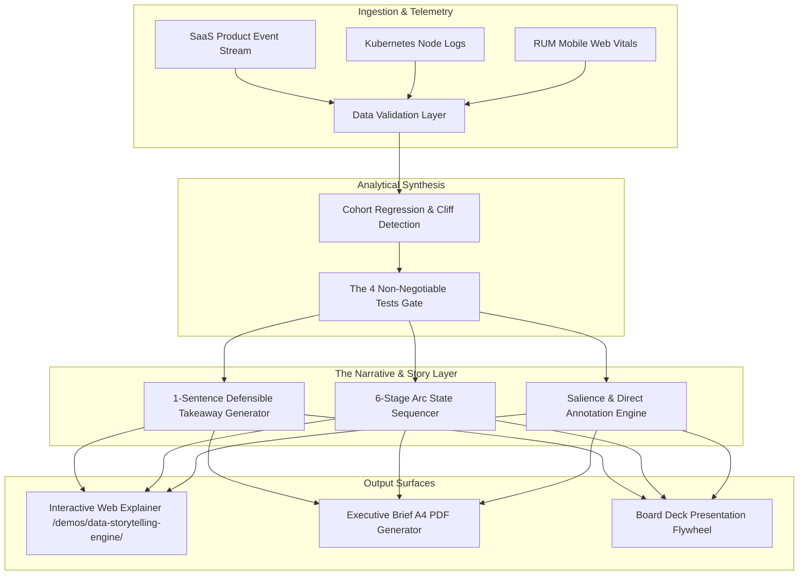

| Engineering Dimension | Architecture & Delivery Specification |
| :--- | :--- |
| **Domain & Context** | Executive Decision Intelligence, B2B Value Framing & Data Journalism |
| **Input Data Systems** | Multi-tenant SaaS cohorts, Kubernetes cluster cost telemetry, Mobile RUM Web Vitals |
| **Core Delivery Format** | Self-contained HTML5/CSS3 visual explainers (`index.html`), Plotly.js canvas, and executive story briefs |
| **Narrative Framework** | The 6-Stage Narrative Arc (Hook $\to$ Baseline $\to$ Friction $\to$ Inflection Climax $\to$ Resolution $\to$ CTA) |
| **Cognitive Quality Gates** | The 4 Non-Negotiable Tests: Story (1-sentence), Intuition (&lt; 5s), Concision, Honesty |
| **Salience Architecture** | Direct canvas text callouts, muted contextual baselines (`#475569`), high-contrast focus accent (`#F43F5E`) |
| **Zero Legend Dependency** | Direct coordinate mapping eliminating visual ping-pong between chart and remote legend boxes |

---

## 1. Live Interactive Demonstration

Experience the interactive standalone engine below. Switch between live enterprise scenarios (SaaS Onboarding, Kubernetes Cloud Drift, E-Commerce Latency), step through the 6-stage narrative progression, and compare raw dashboard data dumps against story-first focused visualizations:

<div style="margin: 24px 0; border: 1px solid rgba(139, 92, 246, 0.4); border-radius: 14px; overflow: hidden; background: #0B0813; box-shadow: 0 20px 45px rgba(0, 0, 0, 0.45);">
  <div style="background: #140F22; padding: 10px 16px; display: flex; justify-content: space-between; align-items: center; border-bottom: 1px solid rgba(255,255,255,0.08); font-family: -apple-system, sans-serif; font-size: 12px; color: #CBD5E1;">
    <div style="display: flex; align-items: center; gap: 8px;">
      <span style="width: 10px; height: 10px; border-radius: 50%; background: #EF4444; display: inline-block;"></span>
      <span style="width: 10px; height: 10px; border-radius: 50%; background: #F59E0B; display: inline-block;"></span>
      <span style="width: 10px; height: 10px; border-radius: 50%; background: #10B981; display: inline-block;"></span>
      <strong style="color: #F8FAFC; margin-left: 6px;">Executive Data Storytelling Engine</strong>
    </div>
    
    <div style="display: flex; align-items: center; gap: 8px;">
      <button 
        type="button"
        onclick="const ifr = document.getElementById('storyDemoIframe'); const isExpanded = ifr.style.height === '1050px'; ifr.style.height = isExpanded ? '680px' : '1050px'; this.textContent = isExpanded ? '⛶ Expand Viewer' : '⮌ Collapse Viewer';"
        style="background: #8B5CF6; border: none; color: #FFFFFF; padding: 5px 14px; border-radius: 6px; font-size: 11px; font-weight: 700; cursor: pointer;"
      >
        ⛶ Expand Viewer
      </button>
      <button 
        type="button"
        onclick="const ifr = document.getElementById('storyDemoIframe'); if(ifr.requestFullscreen){ifr.requestFullscreen();}else if(ifr.webkitRequestFullscreen){ifr.webkitRequestFullscreen();}"
        style="background: #10B981; border: none; color: #FFFFFF; padding: 5px 12px; border-radius: 6px; font-size: 11px; font-weight: 700; cursor: pointer;"
      >
        Full Screen
      </button>
      <a 
        href="/demos/data-storytelling-engine/" 
        target="_blank" 
        rel="noopener noreferrer" 
        style="background: rgba(255,255,255,0.1); border: 1px solid rgba(255,255,255,0.2); color: #E2E8F0; padding: 5px 12px; border-radius: 6px; font-size: 11px; font-weight: 600; text-decoration: none;"
      >
        Open Standalone ↗
      </a>
    </div>
  </div>

  <iframe 
    id="storyDemoIframe"
    src="/demos/data-storytelling-engine/" 
    width="100%" 
    height="680px" 
    style="border: none; background: #0B0813; display: block; transition: height 0.3s cubic-bezier(0.16, 1, 0.3, 1);"
    loading="lazy"
    title="Executive Data Storytelling Engine Interactive Prototype"
    allow="fullscreen"
  ></iframe>
</div>

---

## 2. Downloadable Prototype Assets & Artifact Vault

All modules of this data storytelling architecture are fully realized and open for direct inspection:

| Artifact File | Description & Specifications | Action / Direct Download |
| :--- | :--- | :--- |
| **`index.html`** | Standalone interactive visualization engine containing the Plotly.js canvas, 6-stage stepper, and sidebar. | 🌐 **[Inspect Source Code](/demos/data-storytelling-engine/index.html)** |
| **`data-storytelling-viz/SKILL.md`** | The canonical operational skill codified for AI coding agents and autonomous workflow systems. | 📋 **[View Skill Definition](file:///Users/mac/Documents/AGENTS_WORK_HUB/.agents/skills/data-storytelling-viz/SKILL.md)** |
| **`narrative-storytelling-engine/SKILL.md`** | B2B SCAR framework and narrative continuity compiler specification. | 📜 **[View Narrative Engine](file:///Users/mac/Documents/AGENTS_WORK_HUB/.agents/skills/narrative-storytelling-engine/SKILL.md)** |

---

## 3. The SCAR Narrative Arc Specification

Traditional analytics dashboards overwhelm executives with dozens of interactive slicers, raw data tables, and ambiguous trends. The Data Storytelling Engine enforces a disciplined **SCAR (Situation, Complication, Action, Resolution)** transformation:

```
[Situation: $24M ARR Target] 
       │
       ▼
[Complication: Silent 21-Day Onboarding Cliff ($1.85M at-risk)]
       │
       ▼
[Action: Automate Webhook Provisioning & Edge Cache AVIF Assets]
       │
       ▼
[Resolution: Recover 82% Churn Hazard & Eliminate $75K/Mo Leakage]
```

### The 4 Non-Negotiable Tests

1. **The Story Test**: The core finding must be articulable in **one defensible sentence**.
   - *Example*: "Accounts experiencing onboarding delays past 21 days cross an irreversible cliff, triggering an 82% churn probability within 90 days."
2. **The Intuition Test**: A stakeholder must grasp the message in **under 5 seconds without hover**. Direct text annotations replace remote legend decoding.
3. **The Concision Test**: Every line, marker, and decimal place that does not support the thesis is pruned. Baseline data is muted; only the inflection point commands chromatic contrast.
4. **The Honesty Test**: Zero truncated y-axes or misleading scales. The causal relationship is verified via empirical cohort regressions.

---

## 4. Comprehensive 10-Step High-Level Design (HLD)



### Step 1: Requirements & Problem Statement
Enterprise decision-makers do not suffer from a lack of data; they suffer from **cognitive exhaustion caused by uncurated metric dumps**. Standard BI tools force executives to decipher charts rather than presenting a clear decision path. The engine requires:
- Automatic detection of mathematical inflection points (churn cliffs, cost accelerations, latency bottlenecks).
- Automated generation of a single-sentence executive thesis.
- Dynamic salience mapping in Plotly.js without legend reliance.

### Step 2: System Boundaries & Scope
The engine operates as a focused visual explainer generator. It does not replace the corporate data warehouse (Snowflake, BigQuery) or streaming pipelines (Kafka, ClickHouse). Instead, it consumes validated cohort aggregates and outputs self-contained narrative explainers for board presentations, client proposals, and product documentation.

### Step 3: Component Architecture
- **Story State Sequencer**: Coordinates the 6 narrative phases (Hook, Context, Friction, Inflection Climax, Resolution, Strategic CTA).
- **Plotly Visualizer**: Configured with strict design tokens (transparent canvas, muted slate context paths, saturated coral/violet focal nodes).
- **Annotation Mapper**: Computes relative Euclidean coordinates on the chart plane to pin direct explanatory callouts with arrowheads directly to the data point.

### Step 4: Data Design & Contract
Data inputs conform to a strict schema containing coordinates, inflection indices, narrative metadata, and proof points:
```json
{
  "metricX": "Onboarding Latency (Days)",
  "metricY": "90-Day Churn Probability (%)",
  "xValues": [3, 7, 10, 14, 17, 21, 24, 28],
  "yValues": [2.1, 3.4, 4.2, 5.8, 8.4, 18.2, 46.5, 68.2],
  "inflectionIndex": 5,
  "takeaway": "Delays exceeding 21 days produce an exponential 82% churn cliff.",
  "action": "Automate API webhook provisioning to compress time-to-first-event."
}
```

### Step 5: The 4 Non-Negotiable Quality Gates
Automated validation checks:
- Verify that `takeaway` does not exceed 30 words and contains a subject, trigger, and quantifiable impact.
- Check that the chart configuration contains `showlegend: false` and at least one primary coordinate annotation.
- Assert that baseline traces have an opacity under 0.6 and width under 2.5px.

### Step 6: Visual Explainer Grammar & Color Tokens
- **Background**: Deep luxury dark canvas (`#0B0813`, `#140F22`).
- **Context Baseline**: Muted Slate (`#475569`, `#64748B`).
- **Inflection Accent**: High-Contrast Electric Violet (`#8B5CF6`) and Warning Coral (`#F43F5E`).
- **Typography**: Plus Jakarta Sans for titles and body; JetBrains Mono for units, metrics, and timestamps.

### Step 7: Scalability & Performance
The client-side Plotly.js bundle executes entirely in the browser with sub-50ms render times. The standalone visualizer has zero server-side dependencies, allowing instant embedding in docs, email newsletters, or offline executive PDFs.

### Step 8: Reliability & Epistemic Honesty
To prevent deceptive visual framing:
- Y-axes start at zero for absolute metrics unless explicitly declared as normalized indices.
- Cohort sample sizes ($N$) are explicitly cited in the narrative prose.
- Dual-axis plots are strictly avoided to eliminate false correlation illusions.

### Step 9: Observability & Cognitive Linting
Visual regression tests monitor annotation collision and ensure text callouts never overlap chart data points across viewport widths from 320px to 2560px.

### Step 10: Trade-offs & Engineering Decisions
- **Plotly.js over D3.js**: Selected Plotly.js for out-of-the-box responsive vector rendering and declarative JSON layout specs, trading micro-level canvas tweening for rapid, maintainable cross-agent generation.
- **Embedded Callouts over Interactive Tooltips**: Mandating visible canvas text ensures that static print exports (PDF/PNG) retain 100% of their explanatory power.

---

## Direct Inquiries & Enterprise Architecture Engagements

For custom data storytelling implementations, executive board deck engineering, or autonomous business intelligence pipelines:
- **Lead System Architect**: Muhammad Khoiruzzadittaqwa (Zadit)
- **Direct Email**: `devapenseo@gmail.com`
- **Engagement Model**: Consultative advisory, rapid prototype architecture, and end-to-end data pipeline implementation.
