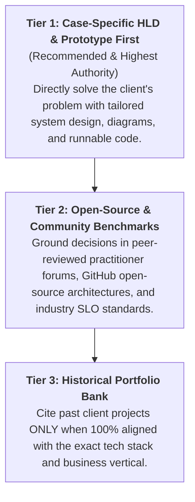

# The 3-Tier Adaptive Proof Methodology

Traditional freelancing is broken by speculation. Bidders copy-paste generic agency templates, boast of irrelevant historical projects, or make premature claims without inspecting the client's actual failure modes.

At **PT PRISMA DIGITAL KREATIF**, we operate under an engineering-first protocol codified as the **3-Tier Adaptive Proof Paradigm**.

---

## 🏛️ The Hierarchy of Proof

### 1. Tier 1: Case-Specific HLD & Prototype First
Before a proposal is submitted or code is modified:
- We dissect the client's brief and attached documents to identify core failure modes.
- We produce a **10-step High-Level Design (HLD)** separating functional requirements from non-functional constraints (LCP, latency SLOs, security).
- We scaffold a verifiable prototype or diagnostic audit tool in our local delivery vault.
- We link the live case study directly in our proposal, giving the client immediate, undeniable proof.

### 2. Tier 2: Open-Source & Community Benchmarks
When designing solutions:
- We analyze open-source reference implementations, standard architectural patterns, and practitioner discussions (Reddit r/webdev, StackOverflow, WordPress/AWS developer forums).
- We avoid proprietary black boxes, preferring maintainable, transparent open-source foundations.

### 3. Tier 3: Historical Portfolio Bank
- We reject the habit of forcing irrelevant portfolio items (e.g. citing an academic paper when a client needs a WooCommerce fix).
- Past case studies are cited strictly when there is a 1-to-1 domain match.

---

## 🛡️ Builder-OS Gatekeeping: What Good Looks Like

We enforce strict quality gates inspired by `builder-os` on every architecture document:

| Attribute | What Bad Looks Like (Generic Freelancing Slop) | What Good Looks Like (Architectural Rigor) |
|---|---|---|
| **Diagnosis** | Guessing what's broken and promising instant "magic fixes". | Running non-destructive diagnostics on a staging clone first. |
| **Tech Stack** | Forcing heavy microservices on a simple $60 store. | Choosing pragmatic monolithic WordPress/PHP architecture matching client budget. |
| **Communication** | "I am an expert with 10 years experience who will deliver cutting-edge solutions." | "I reviewed your 5 tasks, identified the mobile layout bottleneck, and outlined a 10-hour roadmap." |
| **Deliverables** | Unverified promises with zero visual reference. | Complete Mermaid system diagrams, syntax-checked code, and verifiable milestones. |

---

## 🔗 How This Benefits Clients

By reading our case studies, clients gain:
1. **Zero Discovery Risk:** You see how we think and how we solve your problem before spending a single dollar.
2. **Clear Boundaries:** Explicit Architecture Decision Records (ADRs) explain what is in-scope, what is out-of-scope, and what technical trade-offs exist.
3. **Reproducible Code:** All scripts are clean, documented, and ready for immediate deployment on safe staging environments.
