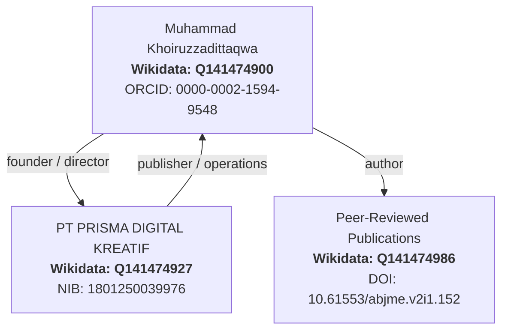

| Parameter | Semantic Specification |
| :--- | :--- |
| **Domain** | Semantic Web, Knowledge Graph, Entity SEO, AI Citability |
| **Individual Entity** | Muhammad Khoiruzzadittaqwa ([Wikidata Q141474900](https://www.wikidata.org/wiki/Q141474900)) |
| **Corporate Entity** | PT PRISMA DIGITAL KREATIF ([Wikidata Q141474927](https://www.wikidata.org/wiki/Q141474927)) |
| **Pillar** | 2. SEO |

---

## 1. The Entity Authority Paradigm

In the era of Generative Engine Optimization (GEO) and AI Overviews, search retrieval algorithms (Google, Perplexity, ChatGPT Search) no longer index websites merely as strings of keywords; they map queries to real-world verified entities ("things, not strings").

Portfolios and agencies disconnected from unambiguous knowledge graphs remain untrusted anonymous sources with negligible Experience, Expertise, Authoritativeness, and Trustworthiness (E-E-A-T).

---

## 2. Tri-Node Semantic Graph Architecture



---

## 3. Production JSON-LD Schema Blueprint

Every asset in the vault implements structured `@graph` nodes linking identity claims to cryptographic and institutional records:

```json
{
  "@context": "https://schema.org",
  "@graph": [
    {
      "@type": "Person",
      "@id": "https://zadevpenseo.github.io/#person",
      "name": "Muhammad Khoiruzzadittaqwa",
      "alternateName": ["Zadit", "zadevpenseo"],
      "sameAs": [
        "https://www.wikidata.org/wiki/Q141474900",
        "https://orcid.org/0000-0002-1594-9548",
        "https://scholar.google.com/citations?user=CbR250MAAAAJ",
        "https://github.com/zadevpenseo"
      ]
    },
    {
      "@type": "Organization",
      "@id": "https://zadevpenseo.github.io/#org",
      "name": "PT PRISMA DIGITAL KREATIF",
      "url": "https://zadevpenseo.github.io/",
      "identifier": "NIB 1801250039976",
      "sameAs": [
        "https://www.wikidata.org/wiki/Q141474927"
      ]
    }
  ]
}
```

---

## 4. Verification Deliverables

- Wikidata item `Q141474900` linked to official government and academic registers.
- Validated Schema.org markup passing Google Rich Results testing.
- Verified ORCID metadata cross-referenced across indexed scientific publications.
