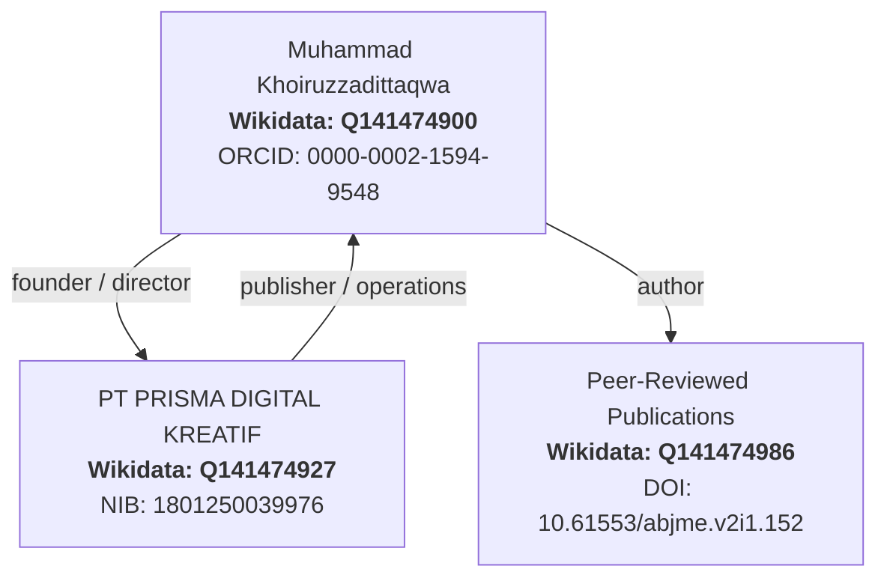

# Entity Knowledge Graph Architecture

| Parameter | Spesifikasi Semantik |
| :--- | :--- |
| **Domain** | Semantic Web, Knowledge Graph, Entity SEO, AI Citability |
| **Entitas Perorangan** | Muhammad Khoiruzzadittaqwa ([Wikidata Q141474900](https://www.wikidata.org/wiki/Q141474900)) |
| **Entitas Korporasi** | PT PRISMA DIGITAL KREATIF ([Wikidata Q141474927](https://www.wikidata.org/wiki/Q141474927)) |
| **Pillar** | 2. SEO |

---

## 1. The Entity Authority Paradigm

Di era Generative Engine Optimization (GEO) dan AI Overviews, algoritma mesin pencari seperti Google Search, Perplexity, dan ChatGPT tidak lagi hanya merayapi kata kunci berbasis teks (*strings*), melainkan mengenali entitas dunia nyata (*things*).

Sebuah website personal atau agensi yang tidak terhubung dengan graph entitas otoritatif akan dianggap sebagai sumber anonim yang memiliki tingkat kepercayaan (E-E-A-T) rendah.

---

## 2. Tri-Node Semantic Graph Architecture



---

## 3. Implementasi JSON-LD Schema

Cetak biru skema terstruktur yang disematkan pada setiap aset web:

```json
{
  "@context": "https://schema.org",
  "@graph": [
    {
      "@type": "Person",
      "@id": "https://zadevpenseo.github.io/#person",
      "name": "Muhammad Khoiruzzadittaqwa",
      "alternateName": "Zadit",
      "sameAs": [
        "https://www.wikidata.org/wiki/Q141474900",
        "https://orcid.org/0000-0002-1594-9548",
        "https://scholar.google.com/citations?user=CbR250MAAAAJ"
      ]
    },
    {
      "@type": "Organization",
      "@id": "https://zadevpenseo.github.io/#org",
      "name": "PT PRISMA DIGITAL KREATIF",
      "founder": { "@id": "https://zadevpenseo.github.io/#person" },
      "sameAs": [
        "https://www.wikidata.org/wiki/Q141474927"
      ]
    }
  ]
}
```

---

## 4. Hubungi Tim Semantic Engineering

- **Email:** `devapenseo@gmail.com`
