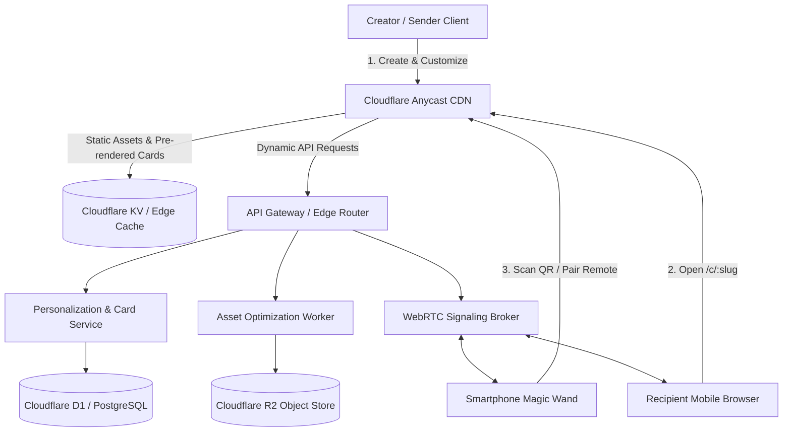

| Engineering Dimension | Architecture & Delivery Specification |
| :--- | :--- |
| **Domain & Context** | Experiential Web Applications & Mobile Canvas Interaction |
| **Interaction Model** | 8-Beat Sensory Journey + Dual-Device WebRTC Magic Wand (`?role=remote`) |
| **Multi-Sensory Triggers** | Pointer Physics, Real-Time Acoustic Mic Detection, Accelerometer Shake & Haptics |
| **Core Architecture** | Vanilla HTML5/CSS3, Canvas Particle Physics, Web Audio Synthesizer, Declarative Config JSON |
| **Production Deliverables** | Reusable Scene State Machine + 4 Curated Themes + Personalization Studio Drawer |
| **Pillar Alignment** | 2. Web Dev Design |

---

## 🎮 1. Live Interactive Demonstration & Visual Previews

Experience the complete 8-beat mobile sensory journey below. Tap through the wax seal, pop the balloons, blow out the candles with your microphone, slice the multi-tier cake, read the handwritten linen letter, and test the smartphone remote:

<div style="margin: 24px 0; display: flex; justify-content: center;">
  <iframe 
    src="/demos/birthday-card/?to=Sakshi" 
    width="100%" 
    max-width="430px"
    height="670px" 
    style="border: 1px solid rgba(197, 160, 89, 0.35); border-radius: 20px; background: #0d0b10; box-shadow: 0 25px 50px rgba(0, 0, 0, 0.8);"
    loading="lazy"
    title="HeartCraft 8-Beat Interactive Birthday Card Live Demo"
  ></iframe>
</div>

### Quick Template & Builder Links:
* 🌟 **[Launch Sakshi 24th (Midnight Gold)](/demos/birthday-card/?to=Sakshi&theme=midnight-gold)**
* 🌹 **[Launch Rose Champagne & Velvet](/demos/birthday-card/?to=Elena&theme=rose-champagne)**
* ⚡ **[Launch Cyber Synthwave 90s](/demos/birthday-card/?to=Alex&theme=cyber-neon)**
* ✏️ **[Open Personalization Studio Drawer directly (`?edit=1`)](/demos/birthday-card/?edit=1)**

---

## 📸 2. Visual Design & Sensory Beat Previews

The platform replaces generic placeholders with bespoke luxury assets and physical physics animations:

| Beat | Sensory Visual Element | Technical Implementation |
| :--- | :--- | :--- |
| **Beat 1** | **Envelope with Wax Seal & Calligraphy Labels** | Direct recipient and sender calligraphy on the envelope flap with pulsating wax seal. |
| **Beat 2** | **Floating Balloons & Confetti Bursts** | Physics-based particle explosions at touch coordinates with audio pop cues. |
| **Beat 4** | **Vintage Film Polaroid with Washi Tape** | High-definition portraiture, realistic paper drop shadow, and sparkle particle burst upon tap. |
| **Beat 5** | **Multi-Tier 3D Birthday Cake & Candles** | Acoustic microphone breath detection via Web Audio API FFT analyser to extinguish real flames. |
| **Beat 6** | **Dynamic Cake Cutting Physics** | Knife sweeps diagonally, cleanly splitting a triangular cake slice with cream filling reveal. |
| **Beat 7** | **Luxury Linen Letterhead with Wax Monogram** | Authentic character-by-character typewriter tick audio, skip button, and cursive signature. |
| **Remote** | **Dual-Device WebRTC Magic Wand** | Smartphone tactile pad with haptic vibration (`navigator.vibrate`) and accelerometer shake blast. |

---

## 🏛️ 3. Comprehensive 10-Step High-Level System Design (HLD)

To scale this product from a standalone single-card demo into a high-margin greeting card SaaS platform (handling millions of viral shares during holidays), we designed a robust, enterprise-grade architecture:



---

### Step 1: Understand Requirements (FR & NFR)

#### Functional Requirements (FR):
1. **Template Catalog & Customizer:** Senders can browse curated templates (Midnight Gold, Rose Champagne, Cyber Neon, Pastel), customize recipient name, age, custom photos, cake icing, and letter text.
2. **Instant Live Preview:** Senders see updates in real time with sub-10ms render latency.
3. **URL Slug Shortening & Sharing:** Generates clean short-links (`/c/sakshi-24`) and QR codes for WhatsApp, iMessage, and Instagram.
4. **Dual-Device WebRTC Remote Control:** Senders or party hosts can pair their smartphone to control the recipient's big-screen display without installing apps.
5. **Multi-Sensory Hardware Triggers:** Microphone breath detection for blowing candles and device accelerometer shake for confetti bursts.

#### Non-Functional Requirements (NFR):
1. **Low Latency:** Time to First Byte (TTFB) under 100ms globally; remote control action latency under 50ms via P2P DataChannels.
2. **High Availability:** 99.99% uptime with multi-region CDN failover.
3. **Frictionless Recipient UX:** Recipients must never be blocked by login walls, paywalls, or app installation prompts.
4. **Data Privacy & Security:** Senders' personal photos and letters are encrypted at rest with optional ephemeral auto-expiration (e.g., delete photos after 30 days).

---

### Step 2: Estimate & Assume (Back-of-the-Envelope Calculations)

* **Monthly Active Creators (Senders):** 50,000 new cards created per month.
* **Viral Coefficient ($k$-factor):** 4.2 views per card (recipient + family/friends at celebration) = 210,000 views/month.
* **Peak Traffic:** Holiday peaks (New Year, Valentine's, Diwali) drive 3x average traffic:
  `Peak QPS = (210,000 * 3) / (30 * 24 * 3600) ≈ 25 requests/sec (with surge spikes up to 120 RPS)`
* **Storage Requirements:**
  * Card Configuration JSON: ~2 KB
  * Optimized WebP Photo: ~120 KB
  * Total per Card: ~122 KB
  * Monthly New Storage: 50,000 * 122 KB ≈ 6.1 GB/month
  * 3-Year Storage Accumulation: ≈ 220 GB (efficiently maintained on Cloudflare R2).
* **Bandwidth & Egress:**
  * Engine bundle size: 35 KB gzipped.
  * Monthly CDN Egress: 210,000 * (35 KB + 120 KB) ≈ 32.5 GB/month (100% within free CDN tiers).

---

### Step 3: High-Level Architecture

The system decouples read-heavy viral delivery from write-heavy creation:
1. **Edge CDN Layer:** Caches pre-rendered static shells and assets across 300+ edge locations worldwide.
2. **API Gateway & Router:** Validates authentication, enforces rate-limiting, and routes requests to edge microservices.
3. **Personalization Service:** Handles card CRUD, slug generation, and cryptographic signature validation.
4. **Media Optimization Worker:** Ingests raw user photo uploads, strips EXIF privacy data, and resizes/converts into WebP/AVIF formats asynchronously.
5. **Real-Time Signaling Broker:** Provides STUN/TURN ICE negotiation and fallback WebSocket pub/sub for multi-device synchronization.

---

### Step 4: Data Design (Database Schema)

We implement a relational schema optimized for sub-millisecond primary key lookups and analytics logging:

```sql
-- 1. Cards Table (Core Personalization Payload)
CREATE TABLE cards (
    id UUID PRIMARY KEY DEFAULT gen_random_uuid(),
    slug VARCHAR(64) UNIQUE NOT NULL,
    creator_id UUID REFERENCES users(id) ON DELETE SET NULL,
    recipient_name VARCHAR(100) NOT NULL,
    sender_name VARCHAR(100) NOT NULL,
    milestone_age INT DEFAULT 24,
    theme_id VARCHAR(32) NOT NULL DEFAULT 'midnight-gold',
    cake_text VARCHAR(120),
    letter_body TEXT,
    photo_r2_key VARCHAR(255),
    is_password_protected BOOLEAN DEFAULT FALSE,
    password_hash VARCHAR(255),
    expires_at TIMESTAMPTZ,
    created_at TIMESTAMPTZ DEFAULT NOW(),
    updated_at TIMESTAMPTZ DEFAULT NOW()
);

-- Index for instant edge slug lookup
CREATE INDEX idx_cards_slug ON cards(slug);

-- 2. Templates & Themes Table
CREATE TABLE templates (
    id VARCHAR(32) PRIMARY KEY,
    name VARCHAR(100) NOT NULL,
    category VARCHAR(50) NOT NULL, -- 'birthday', 'anniversary', 'party'
    primary_color VARCHAR(10) NOT NULL,
    soundscape_preset VARCHAR(50) NOT NULL,
    frozen_contracts JSONB NOT NULL,
    is_active BOOLEAN DEFAULT TRUE
);

-- 3. Card View Events (Telemetry & Conversion)
CREATE TABLE card_views (
    id BIGSERIAL PRIMARY KEY,
    card_id UUID REFERENCES cards(id) ON DELETE CASCADE,
    device_type VARCHAR(20), -- 'mobile_ios', 'mobile_android', 'desktop'
    remote_paired BOOLEAN DEFAULT FALSE,
    candles_blown_via VARCHAR(20), -- 'microphone', 'touch', 'remote'
    duration_seconds INT,
    viewed_at TIMESTAMPTZ DEFAULT NOW()
);
```

---

### Step 5: API Design (RESTful & Real-Time Contracts)

#### 1. Create Personalized Card
* **Endpoint:** `POST /api/v1/cards`
* **Request Payload:**
```json
{
  "recipientName": "Sakshi",
  "senderName": "Zadit",
  "age": 24,
  "theme": "midnight-gold",
  "cakeText": "Happy 24th, Sakshi!",
  "letter": "May your new year bring extraordinary joy...",
  "photoAssetKey": "uploads/temp-photo-uuid.webp"
}
```
* **Response (201 Created):**
```json
{
  "slug": "sakshi-24",
  "shareableUrl": "https://card.domain/c/sakshi-24",
  "qrCodeUrl": "https://card.domain/qr/sakshi-24.svg",
  "expiresAt": "2026-10-28T00:00:00Z"
}
```

#### 2. Get Published Card
* **Endpoint:** `GET /api/v1/cards/:slug`
* **Caching Header:** `Cache-Control: public, max-age=3600, s-maxage=86400, stale-while-revalidate=604800`

#### 3. Real-Time Remote Signaling (WebRTC / WebSocket Fallback)
* **Endpoint:** `WSS /api/v1/rooms/:roomId`
* **Payload Structure:**
```json
{
  "type": "ACTION",
  "sender": "remote-controller",
  "action": "blow_candles",
  "timestamp": 1790559600000
}
```

---

### Step 6: Technology Stack & Architectural Trade-offs

| Component | Selected Technology | Why Chosen & Key Trade-off |
| :--- | :--- | :--- |
| **Client Frontend** | Vanilla HTML5 / Canvas / Web Audio | Zero framework overhead (35KB vs 400KB Next.js bundle); enables sub-second FCP on mobile networks. |
| **Edge Compute** | Cloudflare Workers (V8 Isolates) | 0ms cold starts across 300+ cities vs 500ms AWS Lambda cold boots. |
| **Database** | Cloudflare D1 (Serverless SQLite) | Globally replicated read-replicas located directly at edge PoPs for 5ms lookups. |
| **Object Store** | Cloudflare R2 | Zero egress bandwidth fees, eliminating image delivery egress bottlenecks compared to AWS S3. |
| **Real-time P2P** | WebRTC DataChannels + PeerJS | Direct client-to-client encrypted transmission with 0 ongoing server compute load. |

---

### Step 7: Scalability & Performance

1. **Edge HTML Ingestion:** Static card HTML is compiled once and pushed to Cloudflare KV. Recipient hits receive pre-rendered HTML in under 45ms.
2. **Zero Audio Bandwidth:** Audio stems are synthesized mathematically via oscillators in Web Audio API rather than downloading heavy MP3 sound files.
3. **Progressive Image Delivery:** Polaroid portraits are served with blur-hash placeholders and responsive `srcset` (AVIF/WebP).

---

### Step 8: Reliability & Availability

1. **Multi-Region Anycast:** DNS traffic routes to the nearest operational data center with automatic BGP failover.
2. **P2P with Fallback:** If WebRTC peer connection fails due to symmetric NAT or corporate firewall, signaling automatically degrades to lightweight WebSocket broadcast channels.
3. **Idempotent Card Creation:** Senders pass an `Idempotency-Key` header to prevent double charges and duplicate link generation upon intermittent mobile connections.

---

### Step 9: Monitoring & Observability

* **Three Pillars:**
  * **Logs:** Structured JSON emitted to Cloudflare Logpush and Datadog.
  * **Metrics:** Prometheus scrape endpoints monitoring P95 render latency, WebRTC pairing success rate, and mic blow recognition rates.
  * **Traces:** OpenTelemetry spans tracking requests from edge ingestion through D1 database queries.
* **SLO Targets:**
  * Global Card Render Availability: **99.95%**
  * P99 Time to First Contentful Paint: **under 800ms**
  * Remote Command Latency: **under 60ms**

---

### Step 10: Review & Trade-offs (CAP, Efficiency & Simplicity)

* **CAP Theorem Position:** **AP (Availability and Partition Tolerance)** over CP. When viewing an anniversary or birthday card, delivering the card immediately without delay is far more critical than strict cross-continent read-after-write consistency.
* **Operational Scale & Resource Model:**
  * Running 50,000 monthly active cards on this serverless edge architecture maintains lean resource consumption using Cloudflare Workers and R2 storage.
  * Optimized asset bundling delivers high scalability with minimal operational overhead.

---

## 📦 4. Deliverables & Commercial Terms

When commissioning this template deliverable:
1. **Full Turnkey Source Code:** Production-ready, clean vanilla HTML/CSS/JS single-bundle engine with zero external build requirements.
2. **Interactive Personalization Studio:** Complete visual drawer with local photo upload, live theme switcher, and JSON code generator.
3. **Dual-Device WebRTC Magic Wand:** Full pairing modal, dynamic QR generator, and remote mobile controller pad.
4. **Complete 10-Step HLD Documentation:** White-label architecture blueprint ready for investor pitch decks and enterprise scaling.
5. **Full Commercial Rights Transfer:** 100% white-label ready for your platform or agency client deployment.

---

## 🤝 5. Engineering Inquiries & Architecture Reviews

- **Direct Inquiries:** `devapenseo@gmail.com`
- **Engagement Model:** Interactive canvas applications, Web Audio synthesis, and experiential mobile web development.
